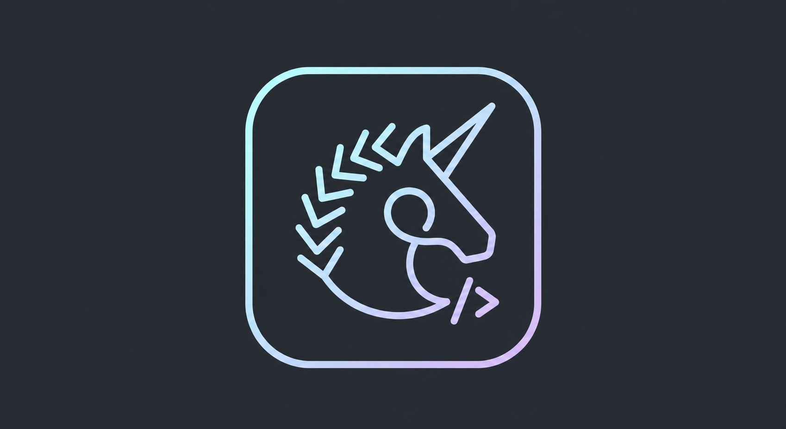

  

<h1 align="center">🦄 UnicornTail</h1>

  <strong>A powerful, open-source micro-SaaS page builder built for everyone. Design visually, publish instantly, or export to production-ready Next.js code.</strong>

---

## ✨ The Story Behind the Name
You might wonder, why **UnicornTail**? The name carries a deeply personal and magical inspiration—it was inspired by the founder's little sister, who is absolutely obsessed with unicorns! Out of all the complex tech names, this was the one that brought the most joy, creativity, and magic into the room, so it stuck.

## 🚀 The Vision
Most traditional No-code page builders lock you into their closed ecosystems. UnicornTail eliminates vendor lock-in completely. 
* **For Everyone:** Anyone can design stunning landing pages visually and publish them instantly to custom subdomains or apex domains.
* **For Developers:** With a single click, UnicornTail compiles your visual layout tree into a highly optimized, production-ready **Next.js (App Router) & Tailwind CSS project**, then pushes it directly to your GitHub repository via GitHub OAuth. No messy HTML dumps—just pure, modular React components.

## 🛠️ The Tech Stack
- **Frontend & Editor:** Next.js 15 (App Router), Tailwind CSS, Craft.js
- **Backend API:** NestJS (TypeScript) adhering to Clean Architecture principles
- **Database:** PostgreSQL (`JSONB` for schema-less components tree traversal)
- **Authentication:** NextAuth.js (Auth.js) with GitHub OAuth

## 🤝 Open for Collaboration (Especially Junior Developers! 💻)
This project is being **built completely in public**! If you are a junior developer, self-taught coder, or just starting your tech journey, please don't be intimidated. We enthusiastically welcome contributions of all skill levels.

### Why contribute to UnicornTail?
- **Real-World Stack:** Gain hands-on experience with Next.js, NestJS, and advanced architectural patterns (AST Compilers, Monorepos).
- **Mentorship:** Every single Pull Request will be reviewed personally with constructive, supportive feedback to help you grow.
- **CV & Portfolio Booster:** Active open-source contributions are the absolute best way to catch the eyes of tech recruiters and show off your skills.

### How to get started:
1. **Fork** the repository.
2. Check out our open issues or the step-by-step roadmap.
3. Open a **Pull Request**!

Let's kill vendor lock-in and build something magical together! ⚡🦄
